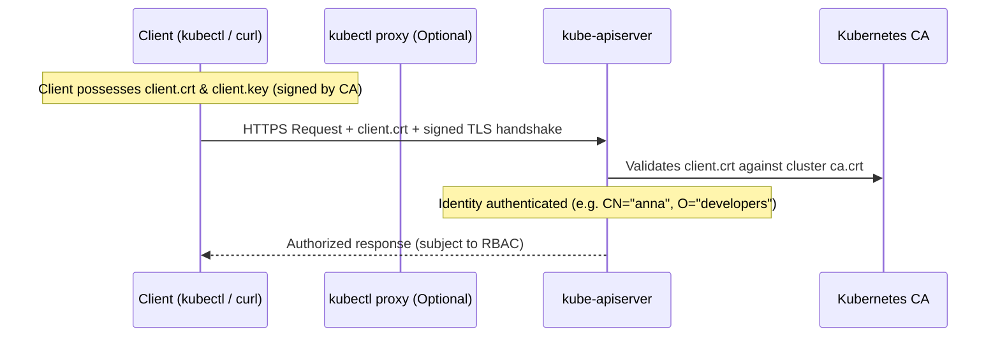

# Kubernetes Security: Authentication & PKI Overview

## 1. Public Key Infrastructure (PKI) & The Cluster Certificate Authority (CA)

At the core of Kubernetes cluster security and identity is **Public Key Infrastructure (PKI)**:

* **Certificate Authority (CA)**:
  * The Certificate Authority is the root of trust for the entire Kubernetes cluster.
  * Located at `/etc/kubernetes/pki/ca.crt` and `/etc/kubernetes/pki/ca.key` on the control plane node.
  * The CA signs certificates for both cluster infrastructure components (API server, etcd, kubelet) and human/client accounts.
* **Public Key Certificate (`.crt`)**:
  * The certificate containing identity metadata (Common Name / `CN`, Organization / `O`) and the digital signature from the cluster CA.
  * Presented to servers and clients to establish identity and negotiate encrypted TLS sessions.
* **Private Key (`.key`)**:
  * The secret cryptographic key held exclusively by the entity (server or client).
  * Used to sign requests and decrypt data; must always remain strictly protected.

---

## 2. Client Authentication in Kubernetes



### What is a "User" in Kubernetes?
* Kubernetes **does not have a native "User" API resource** or user database stored in `etcd`.
* Any client presenting a valid certificate signed by the Kubernetes cluster CA is recognized and authenticated.
* When `kube-apiserver` inspects a client certificate:
  * **Common Name (`CN`)**: Interpreted as the **Username** (e.g., `CN=kubernetes-admin` or `CN=anna`).
  * **Organization (`O`)**: Interpreted as the **Group** (e.g., `O=system:masters` or `O=developers`).

### How `kubectl` Authenticates Automatically
When running commands like `kubectl get pods`:
1. `kubectl` reads credentials from the kubeconfig file (`~/.kube/config`).
2. You can inspect the configured certificate and key data:
   ```bash
   kubectl config view
   # View decoded raw embedded base64 certificates:
   kubectl config view --raw
   ```
3. `kubectl` presents the client certificate with every HTTPS request to `kube-apiserver` (port 6443) via mutual TLS (mTLS).
4. `kube-apiserver` validates the signature against its CA and establishes the user's identity.

---

## 3. Accessing the API without `kubectl`: `kubectl proxy`

When a client or script (such as `curl`, automation tools, or custom web dashboards) needs to interact with the Kubernetes API without directly handling mTLS certificates and keys:

* **Command**:
  ```bash
  kubectl proxy --port=8001
  ```
* **How it Works**:
  * `kubectl proxy` acts as a local HTTP reverse proxy (defaulting to `http://127.0.0.1:8001`).
  * It intercepts incoming plain HTTP requests from tools like `curl`, automatically attaches the certificates and credentials from `~/.kube/config`, and forwards the requests securely over HTTPS to `kube-apiserver`.
* **Example Usage with `curl`**:
  ```bash
  # Query cluster namespaces directly via the proxy:
  curl http://localhost:8001/api/v1/namespaces
  ```

---

## 4. Users, Identity & RBAC (Role-Based Access Control)

### Example: Default Administrator vs. Custom User (`Anna`)
* **`kubernetes-admin` (kubeadmin)**:
  * The default cluster administrator identity generated during cluster provisioning (`kubeadm init`).
  * Authenticates with a certificate signed by the cluster CA with `O=system:masters`.
  * The `system:masters` group is bound by default to the built-in `cluster-admin` ClusterRole, giving it unrestricted root privileges across the entire cluster.
* **Custom User (`Anna`)**:
  * Created by generating a private key and a Certificate Signing Request (CSR) with `CN=anna`.
  * The CSR is signed by the cluster CA, producing a valid client certificate for Anna.

### Authentication (AuthN) vs. Authorization (AuthZ via RBAC)
* **Authentication**: Proves **who you are**. Both `kubernetes-admin` and `Anna` successfully authenticate using valid CA-signed certificates.
* **Authorization**: Determines **what you are allowed to do**.
  * By default, a newly authenticated user (like `Anna`) has **no permissions** and will receive `403 Forbidden` on all API requests.
  * To grant access, administrators configure **RBAC (Role-Based Access Control)**:
    1. **Role / ClusterRole**: Defines allowable operations (verbs: `get`, `list`, `create`, `delete`) on target API resources (`pods`, `services`, `deployments`).
    2. **RoleBinding / ClusterRoleBinding**: Binds the specific user (`Anna`) or group to that role.

---

# Pod and Container Security Context

## 1. What is a Security Context?
A **Security Context** defines privilege and access control settings for Pods, Containers, or both. It enables administrators and developers to enforce the principle of least privilege, restrict root access, apply Linux kernel isolation features, and secure storage access.

* **Configuration Delivery**: Security contexts cannot be configured via simple CLI flags in `kubectl run`; they must be declared in YAML manifests.
* **Two Levels of Application**:
  1. **Pod Level**: Applied to all containers within the pod via `pod.spec.securityContext`.
  2. **Container Level**: Applied to a specific container via `pod.spec.containers[*].securityContext`.
* **Precedence Rule ("More Specific Wins")**:
  * If a setting is defined at both the pod and container levels, **the container-level setting overrides the pod-level setting**.

---

## 2. Pod-Level vs. Container-Level Settings Matrix

The available settings differ between the pod and container levels. Use `kubectl explain` to discover valid fields:
```bash
# Explore Pod-level security fields
kubectl explain pod.spec.securityContext

# Explore Container-level security fields
kubectl explain pod.spec.containers.securityContext
```

| Security Setting | Pod Level (`pod.spec`) | Container Level (`containers[*]`) | Purpose / Behavior |
| :--- | :---: | :---: | :--- |
| **`runAsUser`** | Yes | Yes | Specifies the numeric User ID (UID) executing container processes. |
| **`runAsGroup`** | Yes | Yes | Specifies the primary Group ID (GID) executing container processes. |
| **`runAsNonRoot`** | Yes | Yes | If `true`, the kubelet validates that the image does not run as root (UID 0); fails if root. |
| **`fsGroup`** | **Yes** | No | Supplementary group ID applied to mounted volumes and shared storage. |
| **`allowPrivilegeEscalation`** | No | **Yes** | Controls whether a process can gain more privileges than its parent (sets `no_new_privs`). |
| **`privileged`** | No | **Yes** | Runs container with full host root capabilities and direct hardware/device access. |
| **`capabilities`** | No | **Yes** | Adds or drops specific fine-grained Linux kernel capabilities (`add` / `drop`). |
| **`readOnlyRootFilesystem`** | No | **Yes** | Mounts the container root filesystem as strictly read-only. |
| **`seLinuxOptions`** | Yes | Yes | Configures SELinux labels (`level`, `role`, `type`, `user`). |
| **`seccompProfile`** | Yes | Yes | Restricts system calls using seccomp profiles (`RuntimeDefault`, `Localhost`). |
| **`appArmorProfile`** | Yes | Yes | Enforces AppArmor profiles on supported Linux hosts. |

---

## 3. Core Security Context Settings Explained

### A. Discretionary Access Control (DAC: User & Group IDs)
* **`runAsUser: <UID>`**: Overrides the `USER` instruction inside the Dockerfile/OCI image. E.g., `runAsUser: 1000` prevents running as root (`UID 0`).
* **`runAsGroup: <GID>`**: Sets the primary GID of the process.
* **`runAsNonRoot: true`**: Safeguard preventing accidental execution as root. If the container image defaults to UID 0 and no `runAsUser` is provided, pod startup is blocked with `CreateContainerConfigError`.
* **`fsGroup: <GID>` (Pod Level Only)**:
  * When a pod mounts volumes (e.g., `emptyDir`, `persistentVolumeClaim`), Kubernetes automatically chowns the volume's ownership so its GID equals `fsGroup`.
  * All processes inside the pod's containers automatically receive this GID as a secondary/supplementary group, allowing seamless read/write access to shared volume data.

### B. Privilege & Escalation Controls
* **`allowPrivilegeEscalation: false`**:
  * Prevents child processes from gaining more privileges than their parent process.
  * Specifically prevents `setuid` binaries (e.g., `sudo`, `su`, `passwd`) from elevating privileges within the container.
* **`privileged: true` (High Risk)**:
  * Disables container isolation; the container process has identical privileges to root running directly on the host node.
  * Typically restricted to infrastructure pods (like network plugins or storage drivers).

### C. Linux Capabilities (`add` / `drop`)
Linux divides traditional root power into distinct units called capabilities. You can selectively add or remove capabilities:
```yaml
securityContext:
  capabilities:
    drop:
      - ALL
    add:
      - NET_BIND_SERVICE # Allows binding to low-numbered ports (< 1024)
```

### D. Filesystem Protection: `readOnlyRootFilesystem`
```yaml
securityContext:
  readOnlyRootFilesystem: true
```
* Protects the container root filesystem from tampering, unauthorized file modification, or malware installation.
* If the application needs to write temporary data or logs, dedicated writable directories must be mounted as `emptyDir` volumes.

---

## 4. Comprehensive Example Manifest: `security-context-demo.yaml`

The following example illustrates both pod-level and container-level security contexts, shared volume group permissions (`fsGroup`), and privilege escalation restrictions:

```yaml
apiVersion: v1
kind: Pod
metadata:
  name: security-context-demo
spec:
  # ----------------------------------------------------
  # Pod-level Security Context: applies to all containers
  # ----------------------------------------------------
  securityContext:
    runAsUser: 1000        # Processes run as UID 1000
    runAsGroup: 1000       # Processes run with primary GID 1000
    fsGroup: 2000          # Mounted volume files owned by GID 2000

  volumes:
  - name: secure-vol
    emptyDir: {}

  containers:
  - name: sec-demo-container
    image: busybox:1.36
    command: ["sh", "-c", "sleep 3600"]
    volumeMounts:
    - name: secure-vol
      mountPath: /data/demo

    # --------------------------------------------------------
    # Container-level Security Context: overrides/complements pod
    # --------------------------------------------------------
    securityContext:
      allowPrivilegeEscalation: false
      readOnlyRootFilesystem: false
      capabilities:
        drop:
        - ALL
```

---

## 5. Lab Walkthrough: Deploying & Verifying Security Context

### Step 1: Apply the Manifest
```bash
kubectl apply -f security-context-demo.yaml
kubectl get pod security-context-demo
```

### Step 2: Inspect Running Processes and UID
Open an interactive shell into the container:

```bash
kubectl exec -it security-context-demo -- sh
```

Inside the container shell:

```bash
# 1. Check running process user
ps
# Output shows PID 1 running as UID 1000

# 2. Check user and group IDs
id
# Output: uid=1000 gid=1000 groups=1000,2000(fsgroup)
```

* **Observation**: Even though the process's primary GID is `1000`, the supplementary group `2000` is automatically attached via `fsGroup`.

### Step 3: Verify Mounted Volume Ownership & Permissions
Check the volume mount point:

```bash
ls -ld /data/demo
# Output: drwxrwsr-x 2 root 2000 4096 ... /data/demo
```

* **Observation**: The directory group ownership is automatically set to `2000` (`fsGroup`).

### Step 4: Verify Limited User Restrictions
Attempt to create a file in the root filesystem vs. the mounted volume:

```bash
# Attempt to write to system directory (denied for non-root UID 1000)
touch /etc/forbidden.txt
# Output: touch: /etc/forbidden.txt: Permission denied

# Attempt to write inside the shared fsGroup volume (succeeds)
touch /data/demo/testfile.txt
ls -l /data/demo/testfile.txt
# Output shows file created with group ownership 2000
```

---

## 6. CKA Exam Tips & Official Documentation Links
* In the CKA/CKAD exam, you do not need to memorize every YAML indentation from memory.
* Official Documentation Reference: Search for **"Configure a Security Context for a Pod or Container"** on [kubernetes.io/docs](https://kubernetes.io/docs/tasks/configure-pod-container/security-context/).
* Use `kubectl explain` for fast offline syntax lookup:
  ```bash
  kubectl explain pod.spec.securityContext
  kubectl explain pod.spec.containers.securityContext
  ```

---

# Kubernetes Identity & Access Control: Users, ServiceAccounts, and RBAC

Kubernetes implements a decoupled identity and authorization architecture. Understanding the distinction between **Human Users** and **ServiceAccounts**, how external identity integrates with the cluster, and how **RBAC (Role-Based Access Control)** governs permissions is fundamental to securing Kubernetes clusters.

---

## 1. Kubernetes Identity Model: Normal Users vs. ServiceAccounts

Kubernetes recognizes two distinct categories of entities accessing the API:

```mermaid
graph TD
    subgraph Clients["Entities Accessing kube-apiserver"]
        Human["Human / Normal Users<br/>(Developers, Admins, CI/CD Pipelines)"]
        Workload["Workload / Pods<br/>(In-cluster applications, Operators)"]
    end

    subgraph AuthN["Authentication Layer"]
        Human -->|X.509 Certs / OIDC / Webhook| APIServer["kube-apiserver"]
        Workload -->|Bound ServiceAccount Token (JWT)| APIServer
    end

    subgraph AuthZ["Authorization Layer (RBAC)"]
        APIServer --> Roles["Roles / ClusterRoles<br/>(Verbs & API Resources)"]
        APIServer --> Bindings["RoleBindings / ClusterRoleBindings<br/>(Subject Mapping)"]
    end
```

### Detailed Comparison: Normal Users vs. ServiceAccounts

| Dimension | Normal Users (Human Accounts) | ServiceAccounts (Workload Accounts) |
| :--- | :--- | :--- |
| **Primary Audience** | Humans (cluster admins, developers) and external systems. | In-cluster processes, applications running inside Pods. |
| **Storage in Kubernetes API** | **Not stored** in `etcd`; no `User` API object exists. | **Native API Object** (`kind: ServiceAccount`) stored in `etcd`. |
| **Namespace Scope** | Cluster-wide / Global (independent of namespaces). | **Namespaced** (belongs to a specific namespace). |
| **Default Existence** | None by default (except initial `kubernetes-admin`). | Every namespace automatically has a `default` ServiceAccount. |
| **Authentication Method** | X.509 Client Certs, OIDC tokens (Google, Okta, Azure AD), Webhook tokens. | Signed JWT tokens automatically projected into pods by `kubelet`. |
| **Management Commands** | External PKI / IdP tools (`openssl`, cloud IAM). | Standard `kubectl` commands (`kubectl create sa <name>`). |

---

## 2. How Kubernetes Handles "Normal Users" (Human Accounts)

Because Kubernetes deliberately avoids managing user accounts, passwords, and password resets inside the cluster, user authentication is delegated to external mechanisms:

### A. X.509 Client Certificates (Default kubeadm Model)
* Users possess a private key and a public certificate signed by the cluster Certificate Authority (`ca.crt`).
* `kube-apiserver` parses the certificate's Subject fields:
  * **Common Name (`CN`)** $\rightarrow$ User name (e.g., `CN=anna` or `CN=john`).
  * **Organization (`O`)** $\rightarrow$ Group memberships (e.g., `O=developers`, `O=devops`).

### B. OpenID Connect (OIDC) Identity Providers (Enterprise Standard)
* Enterprises connect Kubernetes to external IdPs such as **Google Workspace**, **Microsoft Entra ID (Azure AD)**, **Okta**, **Keycloak**, or **Dex**.
* **Flow**:
  1. The user logs into their enterprise portal via browser / CLI.
  2. The IdP issues a signed OpenID Connect JSON Web Token (`id_token`).
  3. The user's `kubectl` sends the token in the `Authorization: Bearer <token>` HTTP header.
  4. The `kube-apiserver` verifies the token's cryptographic signature against the IdP's public keys (`--oidc-issuer-url` and `--oidc-client-id` flags) and extracts username (`sub` / `email`) and groups.

### C. Webhook Token Authentication
* `kube-apiserver` sends a remote HTTP POST request with the bearer token to an external authorization/authentication webhook service to verify the user.

---

## 3. How Kubernetes Handles ServiceAccounts

ServiceAccounts provide an authenticable identity for applications running inside pods to query the Kubernetes API (e.g., ingress controllers, Prometheus, backup operators, or custom microservices).

### A. Creating and Managing ServiceAccounts
ServiceAccounts are managed natively via `kubectl`:

```bash
# Create a new service account in namespace "dev"
kubectl create serviceaccount app-sa -n dev

# View service accounts
kubectl get serviceaccount -n dev
```

### B. Automatic Projected Volumes (Bound ServiceAccount Tokens)
When a pod runs, `kubelet` automatically projects a time-limited, audience-bound JWT token into each container at:

```text
/var/run/secrets/kubernetes.io/serviceaccount/
├── ca.crt       # Cluster CA certificate (to verify kube-apiserver TLS)
├── namespace    # Text file containing the pod's namespace
└── token        # Cryptographically signed JWT bearer token
```

### C. Pod Association
To assign a ServiceAccount to a pod, specify `spec.serviceAccountName`:

```yaml
apiVersion: v1
kind: Pod
metadata:
  name: api-client-pod
  namespace: dev
spec:
  serviceAccountName: app-sa
  containers:
  - name: app
    image: curlimages/curl
    command: ["sleep", "3600"]
```

> **Security Best Practice**: If a pod does not need to interact with the Kubernetes API, disable automatic token mounting to prevent credential exposure:
> ```yaml
> spec:
>   automountServiceAccountToken: false
> ```

---

## 4. Role-Based Access Control (RBAC) Architecture

RBAC controls access to the Kubernetes API using four core API resources:

```text
+-------------------------------------------------------------+
|                      RBAC PRIMITIVES                        |
+-------------------------------------------------------------+
|              NAMESPACED              |     CLUSTER-SCOPED   |
+--------------------------------------+----------------------+
| Permissions:  Role                   | ClusterRole          |
| Binding:      RoleBinding            | ClusterRoleBinding   |
+-------------------------------------------------------------+
```

### The 4 RBAC Primitives

1. **`Role`**:
   * Contains rules that grant permissions **within a single, specific namespace**.
   * Example: Permission to read pods and secrets inside namespace `dev`.
2. **`ClusterRole`**:
   * Cluster-scoped permissions that can apply to:
     * **Cluster-scoped resources**: `nodes`, `namespaces`, `persistentvolumes`.
     * **Non-resource endpoints**: `/healthz`, `/metrics`, `/version`.
     * **Namespaced resources across ALL namespaces**: Used when paired with a `ClusterRoleBinding` to grant access across the entire cluster.
3. **`RoleBinding`**:
   * Connects a list of **subjects** (Users, Groups, ServiceAccounts) to a `Role` or `ClusterRole` **within a single namespace**.
   * *Note*: You can bind a `ClusterRole` via a `RoleBinding` to grant a user permissions limited only to that specific namespace!
4. **`ClusterRoleBinding`**:
   * Connects subjects to a `ClusterRole` **across all namespaces in the entire cluster**.

---

## 5. Role vs. ClusterRole: In-Depth Comparison & Binding Patterns

In Kubernetes RBAC, the distinction between **Role** and **ClusterRole** centers on **scope**, **permitted resource types**, and **reusability across namespaces**.

### A. Core Architectural Comparison: Role vs. ClusterRole

| Feature / Dimension | `Role` (Namespaced) | `ClusterRole` (Cluster-Scoped) |
| :--- | :--- | :--- |
| **API Scope** | Namespaced (`metadata.namespace` is required). | Cluster-wide (`metadata.namespace` is prohibited / ignored). |
| **Namespaced Resources** (`pods`, `services`, `deployments`, `secrets`, etc.) | ✅ Supported (confined strictly to the Role's namespace). | ✅ Supported (can apply cluster-wide OR scoped to a namespace via `RoleBinding`). |
| **Cluster-Scoped Resources** (`nodes`, `namespaces`, `pvs`, `storageclasses`, etc.) | ❌ **Forbidden** (cannot govern cluster-level resources). | ✅ **Supported** (grants access across the entire cluster). |
| **Non-Resource URLs** (`/healthz`, `/livez`, `/metrics`, `/version`) | ❌ **Forbidden** (cannot define non-resource paths). | ✅ **Supported** (via `nonResourceURLs` attribute). |
| **Valid Binding Types** | Can **only** be bound by a **`RoleBinding`**. | Can be bound by **`RoleBinding`** OR **`ClusterRoleBinding`**. |
| **Reusability Across Namespaces** | ❌ **Low**: Must duplicate identical Role YAML into every single namespace. | ✅ **High**: Define once globally, reuse across multiple namespaces with local `RoleBindings`. |
| **Role Aggregation** | ❌ Not supported. | ✅ Supported via `aggregationRule` (dynamic rule inheritance). |
| **Imperative CLI Creation** | `kubectl create role <name> --verb=... --resource=... -n <namespace>` | `kubectl create clusterrole <name> --verb=... --resource=...` |

---

### B. Understanding Resource Scopes: Namespaced vs. Cluster-Scoped

Every API resource in Kubernetes is registered as either **Namespaced** or **Cluster-Scoped**. You can query your cluster at any time to verify resource scope:

```bash
# List all namespaced resources (can be governed by Role or ClusterRole):
kubectl api-resources --namespaced=true

# List all cluster-scoped resources (CAN ONLY be governed by ClusterRole):
kubectl api-resources --namespaced=false
```

#### Common Resource Categorization:
* **Namespaced Resources**: `pods`, `services`, `deployments`, `statefulsets`, `daemonsets`, `jobs`, `cronjobs`, `configmaps`, `secrets`, `persistentvolumeclaims` (PVCs), `serviceaccounts`, `roles`, `rolebindings`.
* **Cluster-Scoped Resources**: `nodes`, `namespaces`, `persistentvolumes` (PVs), `storageclasses`, `clusterroles`, `clusterrolebindings`, `customresourcedefinitions` (CRDs), `certificatesigningrequests` (CSRs), `ingressclasses`, `priorityclasses`.

> [!IMPORTANT]
> **Why `Role` Cannot Manage Nodes or Namespaces:**
> Nodes and Namespaces do not reside within any namespace; they exist at the root cluster level. Because a `Role` is strictly bound to a single namespace via its `metadata.namespace`, `kube-apiserver` will reject or ignore any attempt to declare cluster-scoped resources inside a `Role`.

---

### C. The 4 Binding Combinations & Effective Access

Understanding how `Role` and `ClusterRole` interact with `RoleBinding` and `ClusterRoleBinding` is one of the most critical topics in Kubernetes security and the CKA exam.

```text
+-----------------------+-----------------------+--------------------------------------------------------+
| Definition (What)     | Binding (Where/Who)   | Effective Resulting Permission                         |
+-----------------------+-----------------------+--------------------------------------------------------+
| Role                  | RoleBinding           | Confined to that SINGLE namespace only.                |
| ClusterRole           | RoleBinding           | Confined to that SINGLE namespace only! (Reusability)  |
| ClusterRole           | ClusterRoleBinding    | Cluster-wide access across ALL namespaces & resources. |
| Role                  | ClusterRoleBinding    | ❌ INVALID / REJECTED by Kubernetes API Server.        |
+-----------------------+-----------------------+--------------------------------------------------------+
```

#### Detailed Breakdown of Each Combination:

1. **`Role` + `RoleBinding` (Namespace-Isolated)**:
   * Both the permissions definition and the assignment are bound to the same namespace.
   * **Use case**: A team-specific, bespoke set of permissions that only exists in `dev` and nowhere else.

2. **`ClusterRole` + `RoleBinding` (The Golden Reusability Pattern)**:
   * A `ClusterRole` is defined **once** at the cluster level containing rules for namespaced resources (e.g., read access to Pods, ConfigMaps, and Services).
   * A namespace administrator creates a **`RoleBinding`** inside their specific namespace (e.g., `marketing`), referencing the `ClusterRole` in `roleRef`.
   * **Effective Scope**: The subject (user/group/SA) only receives permissions **inside the `marketing` namespace**! They have **zero** access to any other namespace.
   * **Why this is best practice**: Without this pattern, cluster operators would have to copy and paste the same 50-line `Role` manifest into every single namespace across hundreds of clusters. With this pattern, you maintain 1 global `ClusterRole` and bind it as needed. Standard built-in roles (`admin`, `edit`, `view`) work this way.

3. **`ClusterRole` + `ClusterRoleBinding` (Cluster-Wide Authority)**:
   * The `ClusterRole` permissions are bound globally across the entire cluster.
   * **Effective Scope**:
     * Access to namespaced resources across **all** namespaces (present and future).
     * Access to cluster-scoped resources (`nodes`, `namespaces`, `storageclasses`).
     * Access to non-resource URLs (`/metrics`, `/healthz`).
   * **Use case**: Cluster administrators (`cluster-admin`), cluster-wide ingress controllers, Prometheus monitoring daemons, and CNI plugins.

4. **`Role` + `ClusterRoleBinding` (Illegal / Invalid)**:
   * A `ClusterRoleBinding` requires `roleRef.kind` to be `ClusterRole`.
   * If you attempt to reference `kind: Role` inside a `ClusterRoleBinding`, the API server rejects the request with an admission error:
     ```text
     The ClusterRoleBinding "example-binding" is invalid: roleRef.kind: Unsupported value: "Role": supported values: "ClusterRole"
     ```

---

### D. ClusterRole-Exclusive Capabilities

Beyond standard resource permissions, `ClusterRole` provides two unique features unavailable in standard `Role` definitions:

#### 1. Non-Resource URLs
ClusterRoles can govern access to non-API REST endpoints exposed by `kube-apiserver`, such as health checks and Prometheus metrics endpoints:

```yaml
apiVersion: rbac.authorization.k8s.io/v1
kind: ClusterRole
metadata:
  name: cluster-metrics-reader
rules:
- nonResourceURLs: ["/metrics", "/healthz", "/livez", "/readyz", "/version"]
  verbs: ["get"]
```

#### 2. Dynamic Role Aggregation (`aggregationRule`)
ClusterRoles can automatically inherit rules from other ClusterRoles using label selectors. This allows Kubernetes operators or custom Helm charts to inject new permissions into existing roles without editing the original manifests:

```yaml
apiVersion: rbac.authorization.k8s.io/v1
kind: ClusterRole
metadata:
  name: aggregated-operator-role
aggregationRule:
  clusterRoleSelectors:
  - matchLabels:
      rbac.example.com/aggregate-to-operator: "true"
rules: [] # Automatically populated by kube-controller-manager!
```

> [!NOTE]
> The built-in roles `admin`, `edit`, and `view` use `aggregationRule` to automatically inherit permissions for custom resources when CRDs are installed with matching aggregation labels.

---

### E. Critical Gotcha: Immutability of `roleRef`

Once a `RoleBinding` or `ClusterRoleBinding` is created, its **`roleRef` field is permanently immutable**:

```yaml
roleRef:
  apiGroup: rbac.authorization.k8s.io
  kind: Role          # <--- CANNOT BE CHANGED
  name: pod-reader    # <--- CANNOT BE CHANGED
```

* If you need to bind the subjects to a different Role or ClusterRole, you **must delete the existing binding** and create a new one:
  ```bash
  kubectl delete rolebinding read-pods-binding -n development
  kubectl create rolebinding read-pods-binding --clusterrole=edit --user=anna -n development
  ```
* **Subjects are mutable**: You *can* add, remove, or modify `subjects` on an existing binding in-place using `kubectl edit` or `kubectl apply`.

---

### F. CLI Imperative Command Reference: Role vs. ClusterRole

For rapid administration and CKA exam efficiency, use imperative commands to generate manifests or apply RBAC immediately:

```bash
# -------------------------------------------------------------
# 1. Namespaced Role & RoleBinding (Local dev namespace only)
# -------------------------------------------------------------
# Create Role:
kubectl create role pod-reader \
  --verb=get,list,watch \
  --resource=pods,pods/log \
  --namespace=development

# Create RoleBinding:
kubectl create rolebinding dev-pod-reader-binding \
  --role=pod-reader \
  --user=anna \
  --serviceaccount=development:app-sa \
  --namespace=development

# -------------------------------------------------------------
# 2. ClusterRole + RoleBinding (Global definition, local namespace scope)
# -------------------------------------------------------------
# Create ClusterRole with namespaced resources:
kubectl create clusterrole deployment-manager \
  --verb=get,list,watch,create,update,patch,delete \
  --resource=deployments,statefulsets

# Bind ClusterRole within ONLY the "staging" namespace:
kubectl create rolebinding staging-deployment-binding \
  --clusterrole=deployment-manager \
  --user=john \
  --namespace=staging

# -------------------------------------------------------------
# 3. ClusterRole + ClusterRoleBinding (Global cluster-wide access)
# -------------------------------------------------------------
# Create ClusterRole with cluster-scoped resource (nodes):
kubectl create clusterrole node-inspector \
  --verb=get,list,watch \
  --resource=nodes

# Bind ClusterRole across the ENTIRE cluster:
kubectl create clusterrolebinding global-node-inspector-binding \
  --clusterrole=node-inspector \
  --user=bob \
  --group=sre-team
```

---

## 6. Anatomies of RBAC Rules & Subjects

### A. RBAC Rule Anatomy
A role rule consists of four primary components:
* **`apiGroups`**: The API group of the target resource (`""` for core v1 resources like Pods/Services, `"apps"` for Deployments/DaemonSets, `"batch"` for Jobs).
* **`resources`**: The lowercase plural name of the resources (`pods`, `services`, `deployments`, `configmaps`).
* **`verbs`**: Allowed operations:
  * Read: `get`, `list`, `watch`
  * Write: `create`, `update`, `patch`, `delete`, `deletecollection`
* **`resourceNames`** *(Optional)*: Restricts the rule to specific individual named instances of a resource (e.g. `resourceNames: ["primary-db-config"]`). Note that rules with `resourceNames` cannot restrict `create` or `list` requests because names are not known beforehand.
* **Subresources**: Sub-paths of API resources can be targeted individually:
  * `pods/log`: Access to view pod container logs.
  * `pods/exec`: Access to execute commands inside pod containers.
  * `pods/status`: Permission to update pod status objects.
  * `deployments/scale`: Permission to scale replicas.

```yaml
rules:
# Rule 1: Read pods and view pod logs
- apiGroups: [""]
  resources: ["pods", "pods/log"]
  verbs: ["get", "list", "watch"]

# Rule 2: Edit only a specific ConfigMap
- apiGroups: [""]
  resources: ["configmaps"]
  resourceNames: ["app-config"]
  verbs: ["get", "update", "patch"]
```

### B. Subjects Anatomy
Subjects identify the entities receiving permissions:

```yaml
subjects:
# 1. Human User
- kind: User
  name: anna
  apiGroup: rbac.authorization.k8s.io

# 2. Group
- kind: Group
  name: developers
  apiGroup: rbac.authorization.k8s.io

# 3. ServiceAccount (Requires Namespace!)
- kind: ServiceAccount
  name: app-sa
  namespace: development
```

---

## 7. Predefined Built-in ClusterRoles

Kubernetes provides default ClusterRoles out-of-the-box:

| Built-in ClusterRole | Scope & Privileges | Recommended Use |
| :--- | :--- | :--- |
| **`cluster-admin`** | Superuser access across the entire cluster (`*` on `*`). | Cluster operators (bound to `system:masters`). |
| **`admin`** | Full read/write within a namespace (including roles and rolebindings; cannot modify ResourceQuotas). | Namespace team leads. |
| **`edit`** | Read/write application resources in a namespace (cannot view/edit Roles or RoleBindings). | Application developers. |
| **`view`** | Read-only access to most objects in a namespace (cannot read Secrets). | Read-only auditors, junior developers. |

---

## 8. Testing & Auditing Permissions with `kubectl auth can-i`

The `kubectl auth can-i` command allows administrators and developers to verify authorization policies directly against the API:

```bash
# 1. Check your own current permissions:
kubectl auth can-i create deployments
kubectl auth can-i delete nodes

# 2. Impersonate a human user in a specific namespace:
kubectl auth can-i delete pods -n development --as anna
kubectl auth can-i get secrets -n development --as anna

# 3. Impersonate a human user cluster-wide:
kubectl auth can-i get nodes --as anna

# 4. Impersonate a group:
kubectl auth can-i get configmaps -n development --as-group developers

# 5. Impersonate a ServiceAccount:
kubectl auth can-i list pods -n development --as system:serviceaccount:development:app-sa
```

---

## 9. Comprehensive Working Manifest Examples

### Scenario 1: Isolated Namespaced Role & RoleBinding
A custom `pod-reader` Role defined strictly within namespace `development`, bound to user `anna` and ServiceAccount `app-sa`:

```yaml
apiVersion: v1
kind: Namespace
metadata:
  name: development
---
apiVersion: v1
kind: ServiceAccount
metadata:
  name: app-sa
  namespace: development
---
apiVersion: rbac.authorization.k8s.io/v1
kind: Role
metadata:
  namespace: development
  name: pod-reader
rules:
- apiGroups: [""]
  resources: ["pods", "pods/log"]
  verbs: ["get", "list", "watch"]
---
apiVersion: rbac.authorization.k8s.io/v1
kind: RoleBinding
metadata:
  name: read-pods-binding
  namespace: development
subjects:
- kind: User
  name: anna
  apiGroup: rbac.authorization.k8s.io
- kind: ServiceAccount
  name: app-sa
  namespace: development
roleRef:
  kind: Role
  name: pod-reader
  apiGroup: rbac.authorization.k8s.io
```

---

### Scenario 2: ClusterRole Reused Across Namespaces via RoleBinding (Multi-Tenancy)
A single global `microservice-deployer` ClusterRole is defined once, and reused across multiple distinct namespaces (`staging` and `production`) without duplicating YAML:

```yaml
# Step 1: Define the reusable ClusterRole once globally
apiVersion: rbac.authorization.k8s.io/v1
kind: ClusterRole
metadata:
  name: microservice-deployer
rules:
- apiGroups: ["apps"]
  resources: ["deployments", "statefulsets"]
  verbs: ["get", "list", "watch", "create", "update", "patch", "delete"]
- apiGroups: [""]
  resources: ["services", "configmaps"]
  verbs: ["get", "list", "watch", "create", "update", "patch"]
---
# Step 2: Grant John deployer permissions ONLY in "staging"
apiVersion: rbac.authorization.k8s.io/v1
kind: RoleBinding
metadata:
  name: john-staging-deployer
  namespace: staging
subjects:
- kind: User
  name: john
  apiGroup: rbac.authorization.k8s.io
roleRef:
  kind: ClusterRole
  name: microservice-deployer
  apiGroup: rbac.authorization.k8s.io
---
# Step 3: Grant Alice deployer permissions ONLY in "production"
apiVersion: rbac.authorization.k8s.io/v1
kind: RoleBinding
metadata:
  name: alice-prod-deployer
  namespace: production
subjects:
- kind: User
  name: alice
  apiGroup: rbac.authorization.k8s.io
roleRef:
  kind: ClusterRole
  name: microservice-deployer
  apiGroup: rbac.authorization.k8s.io
```

---

### Scenario 3: ClusterRole & ClusterRoleBinding (Cluster-Wide Operator)
A cluster-wide monitoring and node inspection role bound to the `sre-team` group across the entire cluster:

```yaml
apiVersion: rbac.authorization.k8s.io/v1
kind: ClusterRole
metadata:
  name: cluster-node-and-storage-inspector
rules:
# Cluster-scoped resources:
- apiGroups: [""]
  resources: ["nodes", "persistentvolumes", "namespaces"]
  verbs: ["get", "list", "watch"]
- apiGroups: ["storage.k8s.io"]
  resources: ["storageclasses"]
  verbs: ["get", "list", "watch"]
# Non-resource metrics:
- nonResourceURLs: ["/metrics", "/healthz"]
  verbs: ["get"]
---
apiVersion: rbac.authorization.k8s.io/v1
kind: ClusterRoleBinding
metadata:
  name: global-sre-inspector-binding
subjects:
- kind: Group
  name: sre-team
  apiGroup: rbac.authorization.k8s.io
roleRef:
  kind: ClusterRole
  name: cluster-node-and-storage-inspector
  apiGroup: rbac.authorization.k8s.io
```


