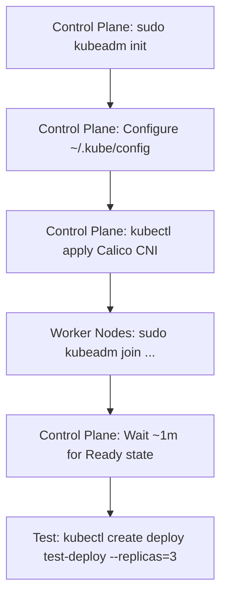
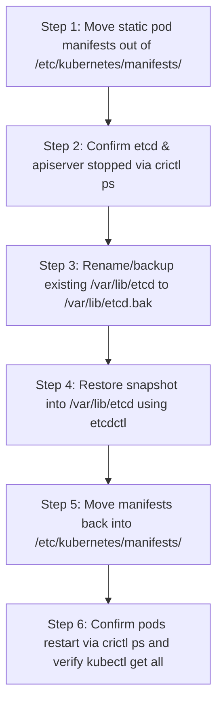
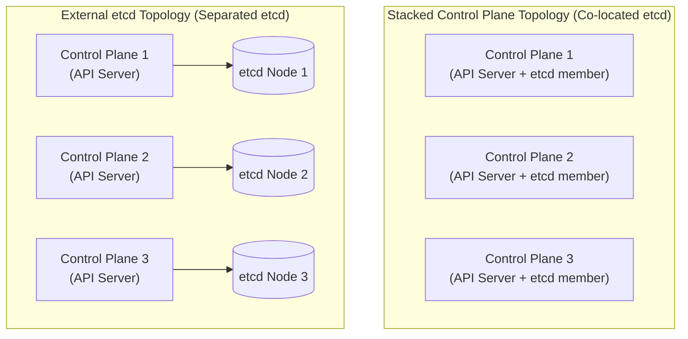

# Kubernetes Study Notes & Cluster Setup Guide

## Roadmap & Topics
* What is kubernetes
* kubernetes architecture
* pre reqisits
* kubernetes providers/types/versions
* kubeadm and its flags
* kubelet and containerd
* .kubeconfig explanation
* connecting master/server with clients/workers

---

# Kubernetes Networking and CNI (Container Network Interface)

## 1. Kubernetes Networking Fundamentals
Kubernetes networking operates across distinct communication layers:

* **Container-to-Container Communication**:
  * Handled **within the same pod**.
  * Containers within a single pod share the same network namespace (communicating seamlessly over `localhost`, local ports, and IPC).
* **Pod-to-Pod Communication**:
  * Handled across cluster nodes by the **Network Plugin (CNI)**.
  * Every pod receives its own unique cluster-wide IP address without requiring NAT or port mapping between pods.

---

## 2. Software-Defined Pod Networks & Add-ons

* **The Need for Network Add-ons**:
  * In order to create a software-defined pod network spanning across multiple worker and control plane nodes, a network add-on or plugin is required.
* **Ecosystem Diversity**:
  * The Kubernetes ecosystem provides a wide variety of network plugins created by different networking vendors.
  * Depending on the networking hardware deployed in your data center, cloud infrastructure, or enterprise environment, you may select a vendor-specific plugin.
  * Even on generic, hardware-agnostic infrastructure, users have the flexibility to choose plugins based on required capabilities, performance, and operational needs.

---

## 3. Vanilla Kubernetes and the CNI Standard

* **No Default Add-on in Vanilla Kubernetes**:
  * Upstream (vanilla) Kubernetes does not include a default network plugin out-of-the-box. This intentional vendor neutrality ensures Kubernetes does not favor any specific vendor or solution.
* **Container Network Interface (CNI)**:
  * Kubernetes implements the **Container Network Interface (CNI)** specification.
  * CNI provides a standardized, generic interface allowing third-party plugins to be plugged into the cluster seamlessly.
* **Feature Availability Depends on the Chosen Plugin**:
  * Advanced network capabilities depend entirely on the specific plugin installed:
    * **Network Policies**: Defining ingress and egress traffic filtering rules between pods and namespaces.
    * **IPv6 Support**: Dual-stack or IPv6-only cluster networking.
    * **Role-Based Access Control (RBAC) at the Network Level**: Enforcing security boundaries directly at the network layer.

---

## 4. Common Kubernetes Network Plugins

| Plugin | Key Characteristics | Network Policy Support | Use Cases & Notes |
| :--- | :--- | :---: | :--- |
| **Calico** | Highly popular, feature-rich, high-performance, supports standard Linux networking, eBPF, and BGP routing. | **Yes** | **Recommended default** if you do not have specific preferences; supports all relevant networking and security features. |
| **Flannel** | Simple, lightweight overlay network (VXLAN/host-gw) widely used in earlier Kubernetes setups. | **No** | Lacks support for Network Policies, making it unsuitable for environments or certification tasks requiring traffic policies. |
| **Multus** | CNI meta-plugin that allows attaching multiple network interfaces to a single pod. | *Delegated* | Built for multi-homed pod networking (e.g., separating data plane and management plane). **Default in Red Hat OpenShift**. |
| **Weave Net** | Resilient mesh network plugin with minimal configuration overhead. | **Yes** | Standard add-on providing overlay networking and network policy enforcement. |

---

## 5. Walkthrough: Installing & Configuring the Calico CNI Plugin

The following procedure demonstrates setting up the Calico network plugin on a newly initialized Kubernetes cluster control plane node.

### Step 1: Check System Pods & Detect Pending CoreDNS
On the control plane node (where `kubectl` has administrative cluster credentials configured):

```bash
kubectl get pods -n kube-system
```

* **Observation**: The `coredns` pods will be in a **`Pending`** state.
* **Root Cause**: CoreDNS requires an active pod network and IP allocation before it can run. Without a configured CNI plugin, CoreDNS cannot be scheduled or initialized.

---

### Step 2: Investigate CoreDNS Scheduling Status
*(Optional tip)*: Enable bash auto-completion for `kubectl` to simplify command execution:

```bash
source <(kubectl completion bash)
```

Inspect one of the pending CoreDNS pods:

```bash
kubectl describe pod <coredns-pod-name> -n kube-system
```

* **Interpreting the Output**:
  * You may see scheduling constraints such as `node(s) had untolerated taint`.
  * In a new cluster where nodes are not yet ready due to missing networking, these conditions prevent non-host-network pods from scheduling. Installing the network plugin resolves this condition.

---

### Step 3: Apply the Calico Manifest
Deploy the Calico CNI plugin using the official manifest:

```bash
kubectl apply -f https://docs.projectcalico.org/manifests/calico.yaml
```

> **Exam / Certification Note (CKA / CKAD)**:
> Candidates are **not** expected to memorize manifest URLs. In certification exams, the cluster will either have the CNI pre-installed or the documentation URL will be provided.

---

### Step 4: Watch Pods Transition to Running
Monitor the deployment of Calico components and CoreDNS startup using the watch flag (`-w`):

```bash
kubectl get pods -n kube-system -w
```

* **Verification**:
  * Watch for Calico controllers and daemonset pods (`calico-kube-controllers`, `calico-node`) to become `Running`.
  * CoreDNS pods will automatically transition from `Pending` to **`Running`**.
  * The cluster network is now fully initialized and ready for application workloads.

---

# Connecting Master/Server with Clients/Workers (`kubeadm join`)

The final step in establishing a functional Kubernetes cluster is connecting worker nodes to the control plane (master).

## 1. Crucial Pre-requisite: Setting Node Names (Hostnames)
* **Hard-Coded Identity**: Before joining any node to the cluster, verify that the machine's hostname/node name is configured to the exact name you intend to use.
* **Why it matters**: The node name is hard-coded into the cluster upon joining. Changing a node name later is difficult—the only resolution is to drain, remove/delete the node from the cluster (`kubectl delete node <node-name>`), reset `kubeadm`, and re-join it.

---

## 2. The Join Token & Join Command
* **Automatic Generation**: When a cluster is initialized with `kubeadm init`, a bootstrap join token and command are automatically generated and displayed in the terminal.
* **Command Syntax**:
  ```bash
  sudo kubeadm join <control-plane-ip>:6443 --token <token> \
      --discovery-token-ca-cert-hash sha256:<hash>
  ```
* **Best Practice**: Copy and paste the `sudo kubeadm join` command directly from the `kubeadm init` terminal output.
* **PKI Material**: The command requires the cluster's PKI certificate authority (CA) hash to securely authenticate and establish mutual trust with the control plane.

---

## 3. Handling Lost or Expired Join Tokens
Join tokens expire after **24 hours** by default. If the token expires or was not saved from the initial setup:

1. On the **control plane node**, generate a fresh token and print the join command:
   ```bash
   sudo kubeadm token create --print-join-command
   ```
2. Copy the resulting command printed to the terminal.

---

## 4. Step-by-Step Walkthrough: Joining Worker Nodes to the Cluster

### Step 1: Check Current Nodes on Control Plane
On the control plane node, check the existing cluster members:

```bash
kubectl get nodes
```
* **Output**: Displays only the single control plane (master) node.

---

### Step 2: Execute Join Command on Worker Nodes
Log into each worker node (e.g., `worker-1`, `worker-2`) and execute the join command using `sudo`:

```bash
sudo kubeadm join <control-plane-ip>:6443 --token <token> --discovery-token-ca-cert-hash sha256:<hash>
```

* **Execution**: Fast output indicating the node has contacted the API server, received TLS bootstrapping credentials, and started `kubelet`.

---

### Step 3: Verify Nodes on Control Plane & Understand the `NotReady` State
Return to the control plane node and verify the nodes:

```bash
kubectl get nodes
```

* **Immediate Observation**: Newly joined worker nodes will appear in a **`NotReady`** state:
  ```text
  NAME          STATUS     ROLES           AGE   VERSION
  control-1     Ready      control-plane   15m   v1.xx.x
  worker-1      NotReady   <none>          20s   v1.xx.x
  worker-2      NotReady   <none>          15s   v1.xx.x
  ```
* **Why Nodes are `NotReady`**:
  * **Do not worry about the `NotReady` status**.
  * It typically takes about **1 minute** for the CNI plugin daemonset (e.g., Calico) to initialize pod networking, configure virtual network interfaces, and report the node as healthy.

---

### Step 4: Final Confirmation (`Ready`)
After approximately one minute, run:

```bash
kubectl get nodes
```

* **Expected Result**: All worker nodes transition to **`Ready`**:
  ```text
  NAME          STATUS   ROLES           AGE     VERSION
  control-1     Ready    control-plane   16m     v1.xx.x
  worker-1      Ready    <none>          1m15s   v1.xx.x
  worker-2      Ready    <none>          1m10s   v1.xx.x
  ```
* The Kubernetes multi-node cluster is now successfully set up and ready for workload deployments.

---

# Cluster Deployment & Run Steps (Core Kubernetes Setup)

> **Scope**: This section extracts only the core operational steps used to run and set up Kubernetes, omitting infrastructure pre-steps (such as installing `containerd`/CRI, cloning repos, and installing kube packages).



## Step 1: Initialize the Cluster (`kubeadm init`)
* **Target Node**: **Control Plane node ONLY**.
* **Command**:
  ```bash
  sudo kubeadm init
  ```
* **Critical Rule**:
  * Run with `sudo` privileges.
  * **Never run `kubeadm init` on worker nodes**. Running `init` on all 3 nodes creates 3 isolated single-node clusters instead of a single multi-node cluster.

---

## Step 2: Configure Client Access (`kubectl` / `.kubeconfig`)
* **Target Node**: **Control Plane node**.
* **Action**: Configure non-root user access to `kubectl` using the commands printed at the end of the `kubeadm init` output:
  ```bash
  mkdir -p $HOME/.kube
  sudo cp -i /etc/kubernetes/admin.conf $HOME/.kube/config
  sudo chown $(id -u):$(id -g) $HOME/.kube/config
  ```
* **Verify Client Connection**:
  ```bash
  kubectl get all
  ```

---

## Step 3: Install the Network Plugin (Calico CNI)
* **Target Node**: **Control Plane node**.
* **Action**: Deploy the software-defined pod network to enable pod-to-pod communication and unblock CoreDNS:
  ```bash
  kubectl apply -f https://docs.projectcalico.org/manifests/calico.yaml
  ```

---

## Step 4: Join Worker Nodes to the Cluster (`kubeadm join`)
* **Target Node**: **Worker nodes (`worker-1`, `worker-2`)**.
* **Command**: Copy the join command provided in the `kubeadm init` terminal output (or generated via `kubeadm token create --print-join-command`) and run with `sudo`:
  ```bash
  sudo kubeadm join <control-plane-ip>:6443 --token <token> \
      --discovery-token-ca-cert-hash sha256:<hash>
  ```
* Connects each worker's `kubelet` to the control plane API server.

---

## Step 5: Verify Node Registration & Readiness
* **Target Node**: **Control Plane node**.
* **Command**:
  ```bash
  kubectl get nodes
  ```
* **Expected Transition**:
  1. Nodes initially appear as **`NotReady`**.
  2. Wait approximately **1 minute** while Calico configures local network interfaces and pod CIDRs on the workers.
  3. Nodes transition to **`Ready`**:
     ```text
     NAME          STATUS   ROLES           AGE     VERSION
     control       Ready    control-plane   10m     v1.xx.x
     worker-1      Ready    <none>          1m15s   v1.xx.x
     worker-2      Ready    <none>          1m10s   v1.xx.x
     ```

---

## Step 6: Final Test & Workload Verification
* **Target Node**: **Control Plane node**.
* **Action**: Deploy an Nginx test workload across the cluster to verify scheduling and pod execution across worker nodes:
  ```bash
  kubectl create deploy test-deploy --image=nginx --replicas=3
  ```
* **Verify Workload & Scheduling**:
  ```bash
  kubectl get deploy,pods -o wide
  ```
* **Confirmation**:
  * Pods enter `ContainerCreating` (confirming nodes are schedulable).
  * After container images are pulled, all 3 replicas transition to **`Running`** distributed across the cluster nodes.

---

# Node Health Analysis & Troubleshooting (Kubernetes & Linux Level)

Analyzing cluster nodes involves inspecting both the Kubernetes API level and the underlying Linux operating system processes.

## Command Reference Summary

| Layer | Command | Primary Purpose / Use Case |
| :--- | :--- | :--- |
| **Kubernetes API** | `kubectl describe node <node-name> \| less` | Comprehensive node inspection: conditions, taints, capacity, running pods, resource allocations, and lifecycle events. |
| **Kubernetes API** | `kubectl top nodes` | Real-time CPU and Memory usage summary per node (requires Metrics Server). |
| **Linux Host** | `sudo systemctl status kubelet` | Verifies `kubelet` runtime status (`active (running)`), PID, resource usage, and recent service messages. |
| **Linux Host** | `journalctl -u kubelet` | Detailed systemd journal logs specifically for the `kubelet` daemon. |
| **Linux Host** | `sudo ls -lrt /var/log` | Lists host log files sorted chronologically (`-rt` places the most recently modified files like `syslog` at the bottom). |

---

## 1. Kubernetes API-Level Node Analysis

### A. Deep-Dive Node Inspection: `kubectl describe node`
Run from the control plane or any configured management workstation:

```bash
kubectl describe node <node-name> | less
```
> **Tip**: The output is comprehensive and usually exceeds terminal height; piping through `less` enables scrolling and searching.

#### Key Output Sections & Diagnostics:
1. **Taints & Schedulability**:
   * Inspects `Unschedulable` status and node taints (e.g., control plane `NoSchedule` taints).
2. **Conditions (Node Sanity Check)**:
   * `Ready`: `True` indicates the node is healthy and able to accept pods.
   * `NetworkUnavailable`: Verifies if CNI networking (e.g., Calico) is properly configured.
   * `MemoryPressure`: `False` indicates sufficient memory.
   * `DiskPressure`: `False` indicates sufficient disk space.
   * `PIDPressure`: `False` indicates available process IDs.
3. **Capacity vs. Allocatable**:
   * **Capacity**: Total physical/virtual hardware resources (CPU cores, RAM, maximum pod limit).
   * **Allocatable**: Net resources available for Kubernetes workloads after OS/kubelet system reservations.
4. **System Info**:
   * Reports kernel version, OS image, Container Runtime (CRI) version (e.g., `containerd://...`), and `kubelet` version.
5. **Non-Terminated Pods & Allocated Resources**:
   * Lists all actively running pods and their respective CPU/Memory resource requests and limits.
6. **Events**:
   * Chronological log of node events and warning messages recorded since boot. This is the first place to look when diagnosing why a node is `NotReady`.

---

### B. Resource Usage Monitoring: `kubectl top nodes`
Inspect live cluster resource consumption:

```bash
kubectl top nodes
```

* **Use Case**: Provides an immediate summary of current CPU and Memory consumption (in raw values and percentages) across all cluster nodes.
* **Prerequisite**: Requires the **Metrics Server** add-on to be installed and actively collecting metrics from node kubelets.

---

## 2. Linux Process & Host-Level Node Analysis

When a node becomes unreachable or reports `NotReady`, connect directly to the node via SSH and analyze it at the Linux operating system level:

### A. Check Kubelet Service Runtime Status
The `kubelet` service is the core agent running on every Kubernetes node. Check its daemon status:

```bash
sudo systemctl status kubelet
```

* **Use Case**:
  * Confirms whether the process is `active (running)`.
  * If the service has failed or is crash-looping, outputs the exit code, PID, and recent fatal error log lines.

---

### B. Inspect Kubelet Logs with `journalctl`
Modern systemd-based Linux systems stream service output to the systemd journal:

```bash
# View complete kubelet service logs
journalctl -u kubelet

# Follow logs in real time
journalctl -u kubelet -f

# View the last 100 log entries
journalctl -u kubelet -n 100 --no-pager
```

* **Use Case**: Troubleshoots lower-level failures including CNI network plugin socket errors, CRI container runtime communication issues, certificate/PKI authentication failures, or API server connection drops.

---

### C. Inspect Host Log Files in `/var/log`
List system log files on the host:

```bash
sudo ls -lrt /var/log
```

* **Use Case**:
  * `-rt` sorts files by reverse modification time so the most recently written log file appears at the bottom.
  * Essential log files:
    * `/var/log/syslog` (Debian/Ubuntu) or `/var/log/messages` (RHEL/CentOS): General operating system, kernel, and driver events.
    * `/var/log/auth.log` (Debian/Ubuntu) or `/var/log/secure` (RHEL/CentOS): User authentication, SSH logins, and sudo executions.

---

# Direct Node Container Management with `crictl`

## 1. What is `crictl`?
* In Kubernetes, all pods are scheduled and started as containers on worker and control plane nodes.
* Kubernetes does not require heavyweight container engines like Docker or Podman on the nodes; it requires only a compliant **Container Runtime** implementing the **CRI (Container Runtime Interface)**, such as `containerd` or CRI-O.
* **`crictl`** is the official CLI utility designed to interface directly with the CRI daemon on the local node.
* **Role**: Serves as a node-level inspection and troubleshooting tool to examine low-level container and pod sandbox behavior without relying on the Kubernetes API server.
* **Key Difference from Docker/Podman**: `crictl` does not provide build commands (like `docker build`) or developer tooling; it focuses strictly on runtime verification, container debugging, and inspection in production Kubernetes nodes.

---

## 2. Configuring CRI Endpoints (`/etc/crictl.yaml`)
To communicate with the container runtime, `crictl` requires both a **runtime endpoint** and an **image endpoint** Unix domain socket.

### Recommended: Persistent Configuration File
Configure `/etc/crictl.yaml` directly on each node:

```yaml
runtime-endpoint: "unix:///var/run/containerd/containerd.sock"
image-endpoint: "unix:///var/run/containerd/containerd.sock"
timeout: 10
debug: false
```

> **Note on Runtimes**: The endpoint path depends on your installed runtime. For `containerd`, use `unix:///var/run/containerd/containerd.sock` (or `unix:///run/containerd/containerd.sock`). For CRI-O, use `unix:///var/run/crio/crio.sock`.

### Alternative: Inline Runtime Flag (Not Recommended)
You can supply the endpoint per-command using the `--runtime-endpoint` flag, though this is tedious:

```bash
sudo crictl --runtime-endpoint unix:///var/run/containerd/containerd.sock ps -a
```

---

## 3. Essential `crictl` Commands Reference

| Command | Description & Diagnostic Use Case |
| :--- | :--- |
| `sudo crictl ps` | Lists all currently active containers running on the local node. |
| `sudo crictl ps -a` | Lists all containers, including stopped, exited, or failed containers. |
| `sudo crictl pods` | Lists all pod sandboxes running on the node (groups containers under their respective pods). |
| `sudo crictl inspect <container-id>` | Outputs full low-level JSON configuration, state, and runtime metadata of a specific container. |
| `sudo crictl images` | Lists all container images stored locally in the node's CRI cache. |
| `sudo crictl pull <image-name>` | Pulls an image directly into the node's local cache without needing Kubernetes to schedule a pod. |
| `crictl --help` | Displays full list of available management commands and debugging options. |

---

## 4. Practical Diagnostic Workflows

### A. List Running Containers
Inspect containers active on the local node (e.g., static control-plane pods like `etcd`, `kube-apiserver`):

```bash
sudo crictl ps
```

### B. List Pod Sandboxes
Verify how containers are organized inside Kubernetes pod sandboxes on this node:

```bash
sudo crictl pods
```

### C. Deep Inspect a Container
Inspect JSON metadata for a specific container (e.g., `etcd` or application container):

```bash
sudo crictl inspect <container-id-or-hash>
```

### D. Pre-Pull Images for Slow/Offline Environments
When deploying a cluster in environments with slow network bandwidth, pre-pull container images before initializing Kubernetes or scheduling workloads:

```bash
sudo crictl pull registry.k8s.io/kube-apiserver:v1.xx.x
sudo crictl pull nginx:latest
```

Verify cached images:

```bash
sudo crictl images
```

---

# Static Pods in Kubernetes

## 1. What Are Static Pods?
* **Direct Kubelet Management**: Static pods are pods created and managed directly by the **`kubelet` daemon** on a specific node without the API server observing or controlling their creation.
* **Control Plane Independence**: The control plane (API server, scheduler, controller-manager) is **not involved** in the lifecycle of a static pod. If a static pod crashes or terminates, `kubelet` automatically restarts it locally.
* **Mirror Pods for Visibility**:
  * `kubelet` attempts to create a **mirror pod** on the Kubernetes API server for each local static pod so that they are visible to cluster operators (e.g., when running `kubectl get pods`).
  * Mirror pods are named with the convention: `<pod-name>-<node-hostname>` (e.g., `kube-apiserver-control`, `static-pod-worker-1`).
  * Mirror pods are strictly read-only representations: attempting `kubectl delete pod <mirror-pod>` will only cause the API server to recreate the mirror object because the actual authoritative manifest resides on the node's local filesystem.
* **Practical Operational Reality**:
  * In day-to-day administration and application deployment, you **almost never have to deal with static pods directly**.
  * They are primarily an internal mechanism utilized by bootstrapping software (such as `kubeadm`) to bring up Kubernetes itself.

---

## 2. Key Use Cases & Bootstrapping Mechanism

1. **Bootstrapping the Kubernetes Control Plane**:
   * When `kubeadm` initializes a cluster, it automatically generates pod manifests for core components and drops them into a directory monitored by `kubelet`.
   * `kubelet` then brings up these core control plane components as static pods:
     1. **`kube-apiserver`**: The central communication and API hub.
     2. **`etcd`**: The distributed key-value store holding cluster state.
     3. **`kube-controller-manager`**: The core controller loop daemon.
     4. **`kube-scheduler`**: Workload scheduling engine.
2. **Cluster Disaster Recovery & Offline Availability**:
   * Because static pods operate independently of the API server, they continue running even if the API server or etcd is down or corrupt.
   * Administrators can deploy emergency troubleshooting, backup restoration, or network repair tools onto a broken node.
3. **Dedicated Node Agents**:
   * Ensures critical host agents (like custom monitoring or proxy software) remain accessible on a node regardless of cluster-wide control plane status.

---

## 3. Configuration & Source Options

`kubelet` supports two primary mechanisms for discovering and syncing static pod manifests:

### Option A: Local Filesystem Directory (Standard `kubeadm` Approach)
* **Configuration File (`/var/lib/kubelet/config.yaml`)**:
  ```yaml
  staticPodPath: /etc/kubernetes/manifests
  ```
* **Kubelet CLI Flag**:
  ```bash
  kubelet --pod-manifest-path=/etc/kubernetes/manifests
  ```
* `kubelet` periodically scans this directory on the host filesystem and synchronizes pod state with the files found inside.
* If modified via config file, apply changes by restarting the service:
  ```bash
  sudo systemctl restart kubelet
  ```

### Option B: Remote Web URL Sync
* **Kubelet CLI Flag**:
  ```bash
  kubelet --manifest-url=<https://example.com/manifests/pod.yaml>
  ```
* `kubelet` periodically fetches and syncs pod manifests from the specified HTTP/HTTPS web URL.

> [!CAUTION]
> **Never modify `staticPodPath` on a Control Plane Node!**
> On a control plane node, changing or breaking `staticPodPath` will prevent `kubelet` from locating `kube-apiserver`, `etcd`, `kube-scheduler`, and `kube-controller-manager`. The entire Kubernetes control plane will immediately fail.

---

## 4. Step-by-Step Walkthrough: Deploying a Static Pod on a Worker Node

The following lab procedure demonstrates creating and verifying a custom static pod on a worker node (`worker-1`).

### Step 1: Generate Pod YAML Manifest (Dry-Run)
On the control plane (or any management node with `kubectl`), generate a valid pod manifest using `--dry-run=client`:

```bash
kubectl run static-pod --image=nginx --dry-run=client -o yaml > static-pod.yaml
```

* **Inspect the generated manifest**:
  ```yaml
  apiVersion: v1
  kind: Pod
  metadata:
    name: static-pod
  spec:
    containers:
    - name: static-pod
      image: nginx
  ```

---

### Step 2: Copy Manifest to the Target Worker Node
Log into the target worker node (e.g., `worker-1` via SSH) and ensure the static pod manifests directory exists:

```bash
sudo mkdir -p /etc/kubernetes/manifests
```

Create `/etc/kubernetes/manifests/static-pod.yaml` and paste the manifest content:

```bash
sudo vim /etc/kubernetes/manifests/static-pod.yaml
```

* **Trigger**: No restart command is needed. The `kubelet` process detects the new file within seconds and instructs the container runtime to launch the container.

---

### Step 3: Verify the Static Pod from Control Plane
Return to the control plane node and verify the pod using `kubectl`:

```bash
kubectl get pods -o wide
```

* **Expected Output**:
  ```text
  NAME                     READY   STATUS    RESTARTS   AGE   IP            NODE       NOMINATED NODE   READINESS GATES
  static-pod-worker-1      1/1     Running   0          25s   10.244.1.5    worker-1   <none>           <none>
  ```
* **Observations**:
  * The pod name automatically has `-<node-name>` appended (`static-pod-worker-1`).
  * The pod is running successfully on `worker-1`.

---

### Step 4: Deleting a Static Pod
To delete the static pod, remove the manifest file directly from the node:

```bash
# On worker-1:
sudo rm /etc/kubernetes/manifests/static-pod.yaml
```

* `kubelet` detects the file removal and stops/deletes the container automatically.

---

# Node State Management & Maintenance (Cordon, Drain, Uncordon, Taints)

During cluster lifecycle operations (e.g., kernel patching, OS upgrades, hardware maintenance, or node decommissioning), administrators must manage node availability to prevent service interruption.

## Core Operations Comparison

| Action | Command | Effect on Existing Pods | Effect on New Pods | Primary Use Case |
| :--- | :--- | :--- | :--- | :--- |
| **Cordon** | `kubectl cordon <node>` | **Left alone** (remain running) | **Blocked** (unschedulable) | Preparing for maintenance without disrupting active workloads. |
| **Drain** | `kubectl drain <node>` | **Evicted** (safely terminated & rescheduled) | **Blocked** (unschedulable) | Taking node offline for reboots, maintenance, or removal. |
| **Uncordon** | `kubectl uncordon <node>` | **Unchanged** (no automatic migration) | **Allowed** (eligible for scheduling) | Returning a serviced node back to active cluster duty. |

---

## 1. Cordoning a Node (`kubectl cordon`)
Cordoning marks a node as unschedulable without disturbing existing running workloads.

```bash
kubectl cordon <node-name>
```

* **Behavior**:
  * Existing pods currently running on the node remain running and untouched.
  * The Kubernetes scheduler will not place any new pods onto this node.
* **Status Check**:
  ```bash
  kubectl get nodes
  ```
  * The node status displays: **`Ready,SchedulingDisabled`**.
* **Under the Hood**:
  * Cordoning applies the following system taint to the node:
    ```text
    Taints: node.kubernetes.io/unschedulable:NoSchedule
    ```
  * Verify with: `kubectl describe node <node-name> | grep -i taints`

---

## 2. Draining a Node (`kubectl drain`) & Important Cautions
Draining is a more aggressive operation used when a node needs to be completely evacuated and taken offline.

```bash
kubectl drain <node-name> [flags]
```

* **Behavior**:
  1. Automatically cordons the node (marks it unschedulable).
  2. Evicts all eligible running pods so their respective controllers (Deployments, ReplicaSets, StatefulSets) recreate them on other available nodes.

### Critical Cautions & Required Flags during `drain`

`kubectl drain` performs pre-flight safety checks and will **refuse to proceed** unless specific flags are provided for non-standard pods:

#### Caution 1: DaemonSet Pods (`--ignore-daemonsets`)
* **Problem**: DaemonSets run system agents (like Calico/Flannel CNI, kube-proxy, monitoring agents) on every node. Draining would fail because the DaemonSet controller would immediately recreate them on the same node.
* **Solution**: You must supply `--ignore-daemonsets` to tell `drain` to leave DaemonSet pods running while evicting user workloads.

#### Caution 2: Local Ephemeral Data (`--delete-emptydir-data`)
* **Problem**: Pods with `emptyDir` volumes store data on the local node's disk. Evicting the pod permanently deletes this local data.
* **Solution**: You must explicitly acknowledge potential local data loss using `--delete-emptydir-data` (formerly `--delete-local-data`).

#### Caution 3: Standalone Pods (`--force`)
* **Problem**: Pods created directly via `kubectl run` without a controller (Deployment, ReplicaSet, Job) cannot be rescheduled by Kubernetes—evicting them deletes them forever.
* **Solution**: Add `--force` if you accept the permanent deletion of unmanaged pods.

### Recommended Standard Drain Command
In production environments, the standard command combining these flags is:

```bash
kubectl drain <node-name> --ignore-daemonsets --delete-emptydir-data
```

---

## 3. Returning Node to Service (`kubectl uncordon`)
Once maintenance or hardware upgrades are complete, restore the node to active duty:

```bash
kubectl uncordon <node-name>
```

* **Behavior**:
  * Removes the `node.kubernetes.io/unschedulable:NoSchedule` taint.
  * Node status in `kubectl get nodes` returns from `SchedulingDisabled` to **`Ready`**.
  * The node becomes eligible to host new pods.

---

## 4. Understanding Taints in Node Management

* **What is a Taint?**
  * A taint is a node property that **repels** pods. Pods will not be scheduled onto a tainted node unless the pod explicitly has a matching **toleration**.
* **How Taints Relate to Cordon & Drain**:
  * When you run `kubectl cordon` or `kubectl drain`, Kubernetes automatically sets the `node.kubernetes.io/unschedulable:NoSchedule` taint.
  * When you run `kubectl uncordon`, Kubernetes removes that taint.
* **Other Taint Occurrences**:
  * **Default Control Plane Taint**: Control plane nodes have a default taint (`node-role.kubernetes.io/control-plane:NoSchedule`) preventing user pods from running on master nodes.
  * **System Condition Taints**: Automatically set during critical node conditions (e.g., `node.kubernetes.io/memory-pressure:NoSchedule`, `node.kubernetes.io/disk-pressure:NoSchedule`, `node.kubernetes.io/network-unavailable:NoSchedule`).
  * **Manual Administrator Taints**: Set via `kubectl taint nodes <node-name> key=value:NoSchedule`.

---

## 5. Critical Scheduling Gotcha: Uncordon Does NOT Auto-Rebalance Pods

> [!WARNING]
> **Kubernetes Does Not Automatically Rebalance Existing Pods!**
> * The Kubernetes scheduler makes placement decisions **only at the exact moment a pod is created or scheduled**.
> * If a node was cordoned and 10 replicas were scheduled onto other nodes, running `kubectl uncordon` on the node **will NOT automatically migrate or redistribute existing pods** to the newly available node.
> * Existing pods remain exactly where they are currently running.
> * **How to Rebalance**: To redistribute workloads across newly available nodes, you must trigger a rolling restart of the deployment:
>   ```bash
>   kubectl rollout restart deployment <deployment-name>
>   ```

---

## 6. Practical Lab Walkthrough: Cordon, Observe Taint, & Uncordon

### Step 1: Check Baseline Node Status
```bash
kubectl get nodes
```
* Shows all nodes in `Ready` state.

### Step 2: Cordon Worker 2
```bash
kubectl cordon worker-2
```
* Check node status:
  ```bash
  kubectl get nodes
  ```
  * Output shows `worker-2` with status `Ready,SchedulingDisabled`.

### Step 3: Inspect Node Taint
```bash
kubectl describe node worker-2 | grep -i taints
```
* Output confirms:
  ```text
  Taints: node.kubernetes.io/unschedulable:NoSchedule
  ```

### Step 4: Test Scheduling Behavior with a Multi-Replica Deployment
Create a test deployment with 10 replicas:

```bash
kubectl create deploy testing --image=nginx --replicas=10
```

Inspect pod placement:

```bash
kubectl get pods -o wide
```
* **Observation**:
  * All 10 pods are scheduled exclusively on `worker-1`!
  * Pods cannot schedule on the control plane (due to default master taint) and cannot schedule on `worker-2` (due to `SchedulingDisabled` / unschedulable taint).

### Step 5: Uncordon Worker 2 & Verify Pod Placement
Restore `worker-2`:

```bash
kubectl uncordon worker-2
```

Inspect pods again:

```bash
kubectl get pods -o wide
```
* **Observation**: All 10 pods remain running on `worker-1`. None have moved to `worker-2`.

### Step 6: Trigger Workload Redistribution
Force the deployment to reschedule across all active nodes:

```bash
kubectl rollout restart deployment testing
kubectl get pods -o wide -w
```
* Now replicas are evenly balanced across `worker-1` and `worker-2`.

---

# Node Service Maintenance & Troubleshooting (Kubelet & Container Runtime)

Every Kubernetes worker node depends on two fundamental host-level Linux daemons managed by `systemd`:
1. **The Container Runtime** (typically `containerd` or CRI-O): Executes and isolates container runtimes.
2. **The Kubelet** (`kubelet`): The primary node agent that communicates with the control plane API server, monitors local pods, and reports node status.

---

## 1. Diagnosing an Unhealthy Node (`NotReady` / `Unknown`)

### Scenario
A node displays `NotReady` in `kubectl get nodes`, but it is **not cordoned** (no `SchedulingDisabled` status).

### Step 1: Inspect Node Conditions & Taints from Control Plane
```bash
kubectl describe node <node-name>
```

#### Key Diagnostic Signals:
* **Conditions**:
  ```text
  Type     Status   Reason                          Message
  ----     ------   ------                          -------
  Ready    Unknown  KubeletStoppedPostingNodeStatus kubelet stopped posting node status
  ```
  * Note: Kubernetes waits for a brief heartbeat timeout before marking the node status as `Unknown` or `NotReady`.
* **Taints**:
  * Kubernetes automatically applies an unreachable taint to repel pods:
    ```text
    Taints: node.kubernetes.io/unreachable:NoSchedule
            node.kubernetes.io/unreachable:NoExecute
    ```

---

## 2. Linux Host-Level Diagnostics (SSH to Affected Node)

When `kubelet stopped posting node status` appears, log into the affected node via SSH to investigate the host services.

### Step 1: Process Check (`ps aux`)
Verify if the underlying daemon processes are currently running:

```bash
# Check if kubelet is running
ps aux | grep kubelet

# Check if container runtime is running
ps aux | grep containerd
```

> [!WARNING]
> **Do Not Use Generic Linux Tools to Manage Pods!**
> While pods appear as processes in `ps aux` on the host, **never** use Linux commands (such as `kill` or `killall`) to manage or stop them directly. Always manage pods via `kubectl` or inspect containers using `crictl ps`.

---

### Step 2: Check Systemd Service Status
Check the status of the `kubelet` service:

```bash
sudo systemctl status kubelet
```

* **Output Analysis**:
  * **Inactive / Dead**: The process was stopped or crashed.
  * **Loaded / Enabled Status**: Check whether the unit file is `enabled` or `disabled`.

---

## 3. Remediation & Critical Exam Tip

### Starting the Service
Start the stopped daemon:

```bash
sudo systemctl start kubelet
```

### Critical Exam / Production Tip: Always Verify Service is Enabled!
> [!IMPORTANT]
> **Check `enabled` vs `disabled` Status**
> * In certification exams (such as CKA) and real-world incidents, an administrator or reboot issue might leave `kubelet` or `containerd` in a **`disabled`** state.
> * If a service is disabled, simply running `systemctl start` will fix the issue temporarily, but the node will fail again on the next reboot!
> * Always ensure the service is enabled to start automatically on system boot:
>   ```bash
>   # Start and enable in a single command:
>   sudo systemctl enable --now kubelet
>   ```
> * Perform the same check for the container runtime if necessary:
>   ```bash
>   sudo systemctl enable --now containerd
>   ```

---

## 4. Verification on Control Plane

After starting the `kubelet` service on the worker node, return to the control plane and verify the cluster status:

```bash
kubectl get nodes
```

* **Expected Result**:
  * Within a few seconds of `kubelet` resuming its heartbeat to the API server, the node transitions back to **`Ready`**.
  * The automatic `node.kubernetes.io/unreachable` taint is removed.
  * The cluster node is fully restored and ready to accept workloads.

---

# etcd Backup and Disaster Recovery

## 1. What is `etcd`?
* **The Brain of Kubernetes**: `etcd` is the distributed, consistent key-value datastore that holds the entire state and all resource definitions (Pods, Deployments, Secrets, ConfigMaps, Namespaces) of a Kubernetes cluster.
* **Critical Importance**: If `etcd` is lost or corrupted, all cluster configuration and state are lost.
* **How it Runs**: On kubeadm-provisioned clusters, `etcd` runs as a **static pod** on the control plane node managed directly by `kubelet` (`/etc/kubernetes/manifests/etcd.yaml`).
* **Tool Required**: Backing up and restoring requires root privileges (`sudo`) and the **`etcdctl`** command-line utility.

---

## 2. Installing and Configuring `etcdctl`

`etcdctl` is not packaged with default `kubeadm`/`kubectl` tools on Debian/Ubuntu systems:

```bash
# Install the etcd client package
sudo apt update && sudo apt install -y etcd-client
```

### Checking the API Version
`etcdctl` supports API v2 and API v3. **Snapshot operations require API v3**:

```bash
# Check if snapshot commands exist
etcdctl --help | grep -i snapshot
```

* If using an older version where snapshot commands are missing, force API v3 by setting the environment variable:
  ```bash
  export ETCDCTL_API=3
  # or prefix commands with ETCDCTL_API=3
  ```

---

## 3. Identifying Required Parameters & PKI Certificates

Communicating with `etcd` requires authenticating via TLS against its listening port. Every `etcdctl` command requires four parameters:

| Parameter Flag | Required Value (Default kubeadm path) | Description |
| :--- | :--- | :--- |
| **`--endpoints`** | `https://127.0.0.1:2379` (or `localhost:2379`) | The client URL where etcd listens for incoming requests. |
| **`--cacert`** | `/etc/kubernetes/pki/etcd/ca.crt` | CA certificate used to verify the etcd server's certificate. |
| **`--cert`** | `/etc/kubernetes/pki/etcd/server.crt` | Client/server TLS certificate for authentication. |
| **`--key`** | `/etc/kubernetes/pki/etcd/server.key` | Private key matching the client/server certificate. |

### How to Discover These Parameters on Any Node
If you forget paths or endpoints during an exam or incident:
1. **Inspect running process arguments**:
   ```bash
   ps aux | grep etcd
   ```
   Look for `--listen-client-urls`, `--trusted-ca-file`, `--cert-file`, and `--key-file`.
2. **Inspect the etcd static pod manifest**:
   ```bash
   cat /etc/kubernetes/manifests/etcd.yaml | grep -E "cert|key|listen-client-urls"
   ```
3. **List the PKI directory**:
   ```bash
   sudo ls -l /etc/kubernetes/pki/etcd/
   ```

---

## 4. Testing etcd Connectivity Before Taking a Backup

Before saving a snapshot, test that `etcdctl` can query the database:

```bash
sudo ETCDCTL_API=3 etcdctl \
  --endpoints=https://127.0.0.1:2379 \
  --cacert=/etc/kubernetes/pki/etcd/ca.crt \
  --cert=/etc/kubernetes/pki/etcd/server.crt \
  --key=/etc/kubernetes/pki/etcd/server.key \
  get / --prefix --keys-only --limit=5
```

* A successful query returns keys without error, confirming TLS authentication is working.

---

## 5. Taking an etcd Snapshot (Backup Procedure)

### Step 1: Save the Snapshot
Execute the `snapshot save` command with the required endpoints and TLS certificates:

```bash
sudo ETCDCTL_API=3 etcdctl \
  --endpoints=https://127.0.0.1:2379 \
  --cacert=/etc/kubernetes/pki/etcd/ca.crt \
  --cert=/etc/kubernetes/pki/etcd/server.crt \
  --key=/etc/kubernetes/pki/etcd/server.key \
  snapshot save /tmp/etcd-backup.db
```

* **Expected Output**:
  ```text
  Snapshot saved at /tmp/etcd-backup.db
  ```

### Step 2: Verify the Snapshot
Verify that the backup file exists, is non-empty (~3–5 MB minimum), and displays valid metadata:

```bash
# Check file size
ls -lh /tmp/etcd-backup.db

# Inspect snapshot status in table format
sudo ETCDCTL_API=3 etcdctl --write-out=table snapshot status /tmp/etcd-backup.db
```

* **Output Table Columns**:
  * `HASH`, `REVISION`, `TOTAL KEYS`, `TOTAL SIZE`.

### Step 3: Safety Copy
Always preserve a secondary copy of the backup file before beginning maintenance or restoration:

```bash
sudo cp /tmp/etcd-backup.db /tmp/etcd-backup.db.bak
```

---

## 6. Restoring an etcd Snapshot (Disaster Recovery Procedure)

Restoring an etcd snapshot requires stopping active control plane processes, replacing the etcd data directory, and restarting services.



### Step 1: Stop the Running Control Plane & etcd
The active instance of etcd must be shut down prior to restoring the datastore to prevent corruption.

```bash
# Create a temporary directory outside kubelet's watch path
sudo mkdir -p /tmp/k8s-manifests-backup

# Move all static pod manifests away from /etc/kubernetes/manifests
sudo mv /etc/kubernetes/manifests/*.yaml /tmp/k8s-manifests-backup/
```

### Step 2: Verify Static Pods Have Stopped
Wait approximately 20–30 seconds for `kubelet` to detect the empty directory and stop the containers:

```bash
sudo crictl ps
```

* Confirm that `etcd` and `kube-apiserver` containers are no longer running.

### Step 3: Back Up / Rename the Old Data Directory
The default etcd data directory is `/var/lib/etcd`. Rename it to keep a safe fallback:

```bash
sudo mv /var/lib/etcd /var/lib/etcd.old
```

### Step 4: Restore the Snapshot to the Data Directory
Run `etcdctl snapshot restore`, specifying the target data directory with `--data-dir`:

```bash
sudo ETCDCTL_API=3 etcdctl snapshot restore /tmp/etcd-backup.db \
  --data-dir=/var/lib/etcd
```

* **Verify Restored Files**:
  ```bash
  sudo ls -l /var/lib/etcd/
  ```
  * Confirm the `member` directory is present with restored database files (`wal/` and `snap/`).

### Step 5: Restore Static Pod Manifests
Move the static pod manifests back into `/etc/kubernetes/manifests/`:

```bash
sudo mv /tmp/k8s-manifests-backup/*.yaml /etc/kubernetes/manifests/
```

### Step 6: Verify Recovery
1. **Monitor container restart**:
   ```bash
   sudo crictl ps
   ```
   * Within 10–30 seconds, `etcd`, `kube-apiserver`, `kube-controller-manager`, and `kube-scheduler` will restart.
2. **Verify cluster state**:
   ```bash
   kubectl get all
   ```
   * All cluster state (Deployments, Pods, Services) will reflect the exact point-in-time state when the snapshot was taken. Any changes created after the backup will be removed, and any resources deleted after the backup will be restored.

---

# Kubernetes Cluster High Availability (HA) Architecture & Setup

## 1. What is High Availability (HA) in Kubernetes?
* **Single Control Plane Risk (SPOF)**: In a basic cluster running only one control plane node, that single node represents a Single Point of Failure. If it crashes or suffers hardware failure, all cluster management APIs, scheduling, and lifecycle controllers are lost.
* **HA Goal**: Deploying multiple control plane nodes so that if any individual control plane node fails, another node immediately takes over without interrupting cluster services or workload operations.

---

## 2. High Availability Topologies

Kubernetes supports two primary HA architectural models:



### Topology 1: Stacked Control Plane (Co-located etcd)
* **Architecture**: The `etcd` members run as static pods directly on the control plane nodes alongside the API server, scheduler, and controller-manager.
* **Infrastructure**: Requires fewer total machines/VMs.
* **Node Requirement**: Minimum of **3 stacked control plane nodes** to establish an odd-numbered etcd quorum (survives 1 failure).
* **Use Case**: Default topology used by `kubeadm` and standard production deployments due to simplified resource management.

### Topology 2: External etcd Cluster
* **Architecture**: The `etcd` distributed database runs on separate, dedicated infrastructure nodes isolated from the Kubernetes control plane nodes.
* **Infrastructure**: Requires twice the physical/virtual machines (e.g., 3 control plane nodes + 3 dedicated etcd nodes).
* **Advantage**: Decouples control plane compute resource consumption from etcd data persistence. Control plane node failures have zero risk of impacting etcd quorum.

---

## 3. The Control Plane Load Balancer Requirement

When multiple control plane nodes run active `kube-apiserver` instances, clients (`kubectl`, worker node `kubelet`s, and controllers) need a single, highly available entry point.

* **Purpose**: Distributes incoming traffic across all control plane API servers (port 6443) and handles automatic failover if a control plane node becomes unreachable.
* **Load Balancer Types**:
  * Cloud managed load balancers (AWS NLB, GCP Load Balancer, Azure Load Balancer).
  * Enterprise hardware appliances (F5, NetScaler).
  * Open-source software stack: **Keepalived + HAProxy**.
* **CKA Exam Note**: Configuring external load balancers and VRRP daemons from scratch is not tested in the CKA exam—exam environments provide pre-configured load balancers or endpoints.

---

## 4. Software Load Balancer Architecture (Keepalived + HAProxy)

In self-managed bare-metal or VM labs, a common pattern runs Keepalived and HAProxy directly across the control nodes:

1. **Keepalived (Virtual IP / VRRP)**:
   * Runs VRRP (Virtual Router Redundancy Protocol) across the nodes.
   * Maintains a shared **Virtual IP (VIP)** (e.g., `192.168.29.100`).
   * Exactly one node holds the VIP at any given time. If that node goes down, Keepalived transfers the VIP to another node automatically.
2. **HAProxy (Reverse Proxy / Load Balancer)**:
   * Listens on port 6443 on the VIP.
   * Forwards client requests to the healthy backend `kube-apiserver` instances running on port 6443 across all control plane nodes.
3. **Client Flow**:
   * `kubectl` / worker `kubelet` $\rightarrow$ Connects to `https://<VIP>:6443` $\rightarrow$ HAProxy load-balances to healthy `kube-apiserver`.

---

## 5. Environment Preparation for HA Clustering

Before running HA cluster setup scripts or initializing multiple control nodes, the host machines require standard inter-node communication prerequisites:

### A. Configure Passwordless sudo
Automated deployment scripts and multi-node setup commands require passwordless sudo across all nodes:

```bash
sudo visudo
```
* Find the line enabling the `sudo` group and modify it:
  ```text
  %sudo   ALL=(ALL:ALL) NOPASSWD: ALL
  ```
* Test on each node: `sudo ls -l /root` (should execute without password prompt).

### B. Configure Passwordless SSH Key Authentication
Setup scripts communicate between nodes using SSH without interactive password prompts:

```bash
# 1. Generate an SSH key pair (on your primary control node)
ssh-keygen -t rsa -b 4096

# 2. Copy the public key to all other control and worker nodes
ssh-copy-id <username>@<remote-node-ip>
```

### C. Verify Network Interface Name
* Check your active network interface name:
  ```bash
  ip -br a
  ```
* Ensure configuration files (such as `keepalived.conf`) match your host network interface (e.g., `ens33`, `ens160`, or `eth0`).

---

## 6. Verifying the Load Balancer

### Step 1: Verify Virtual IP (VIP) Reachability
Prior to Kubernetes installation, test that the Keepalived VIP is responding to ICMP:

```bash
ping -c 3 <VIP>
# e.g., ping -c 3 192.168.29.100
```

### Step 2: Verify Port 6443 Forwarding
Once HAProxy is running and the control plane API servers are initialized, verify TCP port 6443 availability using Netcat (`nc`):

```bash
nc -zv <VIP> 6443
```
* **Expected Result**:
  ```text
  Connection to 192.168.29.100 6443 port [tcp/*] succeeded!
  ```